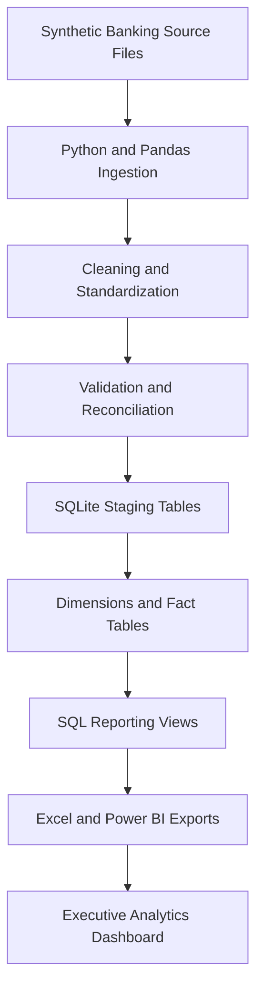
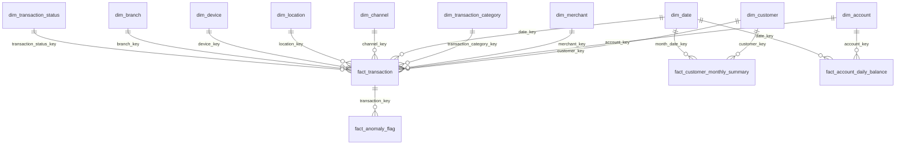

# Architecture

## Pipeline Flow

## Dimensional Model

## Design Choices

- SQLite is used so the project runs locally without external infrastructure.
- Pandas handles practical transformations before loading analytical tables.
- SQL views keep Power BI users away from raw staging tables.
- Unknown dimension rows preserve valid fact rows when optional dimension values are missing.
- Data-quality issues are modeled as an analytical fact table instead of being hidden.
